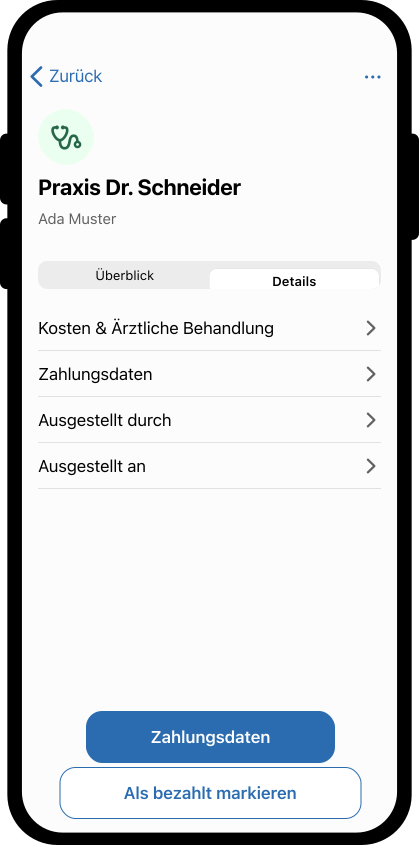

= Use Case - Detail-Ansicht

link:overview.adoc[Zurueck zur Uebersicht]

[cols="h,1"]
|===
| ID | UC_DETAIL_ANSICHT
| Verbindlichkeit | MUSS
| Letzte Aktualisierung | 2026-05-22
| Kurzbeschreibung | Der Use Case beschreibt, wie Versicherte aus der Rechnungsliste die Detail-Ansicht einer Rechnung oeffnen und nutzen.
| Akteure | Versicherter
| Vorbedingungen
 a| * Der Versicherte ist in der App angemeldet. +
* Es existieren Rechnungen für den Versicherten.
| Ausloeser/Trigger | Der Versicherte waehlt in link:UC_RECHNUNGEN_ANZEIGEN.adoc[UC_RECHNUNGEN_ANZEIGEN] eine Rechnung aus.
| Hauptablauf
 a| * Die App oeffnet die Detail-Ansicht zur gewaehlten Rechnung. +
* Die App zeigt mindestens: Rechnungsnummer, Leistungsdatum, Betrag, Status, Leistungserbringer. +
* Die App zeigt die behandelte Person und Zahlungsdaten, falls die Rechnung noch nicht bezahlt ist. +
* Der Versicherte kann moegliche Aktionen nutzen (z. B. einreichen, als bezahlt markieren, archivieren, loeschen).
| Alternativ-/Fehlerablaeufe
 a| * Daten koennen nicht geladen werden: Die App zeigt eine verstaendliche Fehlermeldung mit Retry-Moeglichkeit.
| Nachbedingungen/Ergebnis
 a| * Die Detailinformationen der gewaehlten Rechnung sind sichtbar. +
* Der Versicherte kann in die Uebersicht zurueckkehren oder eine Aktion aus der Detail-Ansicht ausfuehren.
|===

== Mockup

[cols="1,1"]
|===
| 
| 
|===

