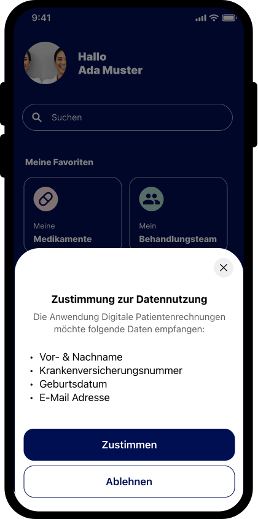
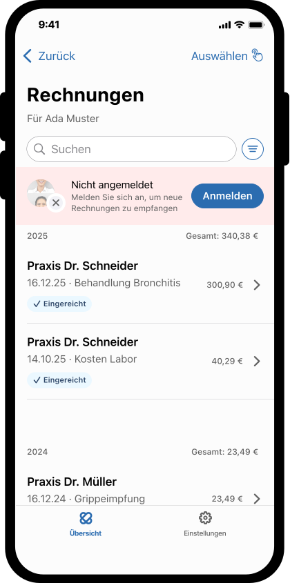
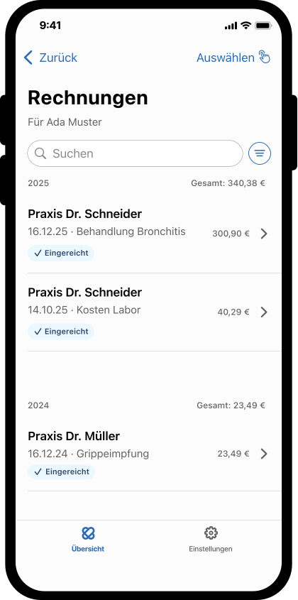
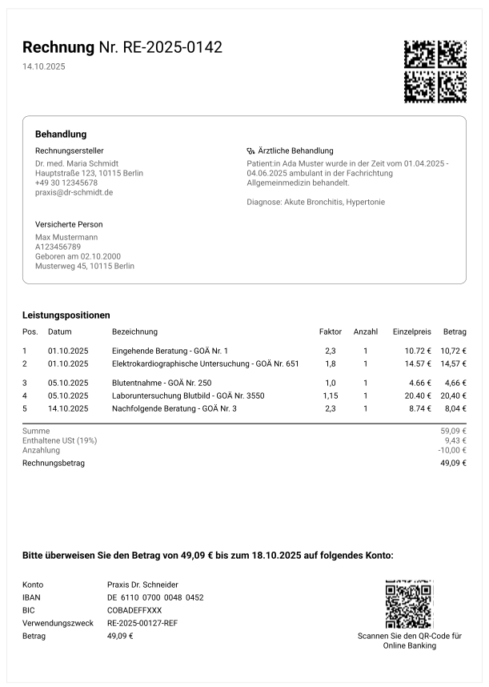
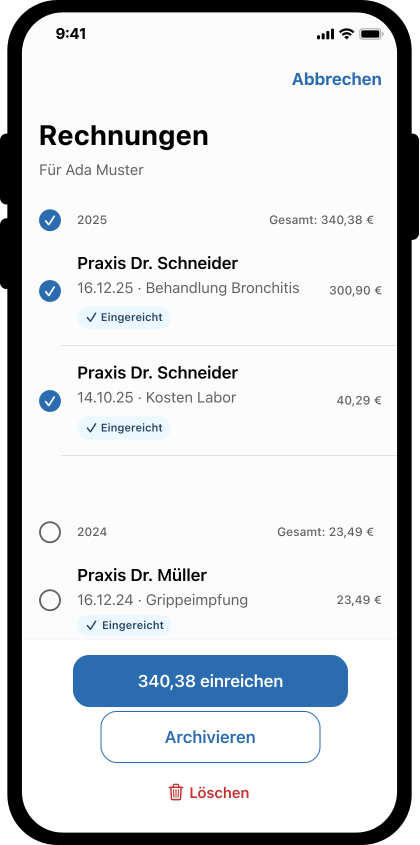
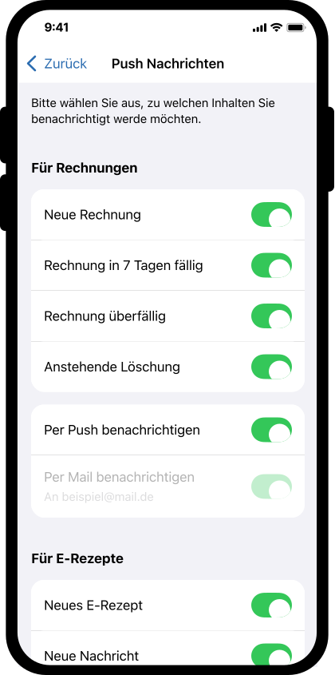

= Modul DiPag
:sectlinks:
:sectanchors:
:toc: left
:icon-app-path: ../images/icon_app_red.svg
:app-icon-inline: image:{icon-app-path}[App, width=20]
:app-icon-legend: image:{icon-app-path}[App, width=120]

[IMPORTANT]
====
🚧 **Dieser Implementierungsleitfaden befindet sich aktuell noch im Aufbau!** 🚧
====

Der folgende Inhalt enthält eine Beispielanwendung aus Sicht des Versicherten und Empfehlungen der Gematik zur Umsetzung für eine gute User Experience. Es handelt sich dabei um eine fiktive App, die auf den Anwendungsfällen der DiPag basiert. Hersteller von Apps für Versicherte können sich an diesem Beispiel orientieren, müssen es aber nicht 1:1 umsetzen.

== App Prototype
Der interaktive Klickdummy zeigt eine Beispielanwendung mit digitalen Patientenrechnungen in einer 2-App-Strategie. Eine 2-App Strategie bedeutet, dass das DiPAG Modul und das Authenticator Modul in getrennten Apps bereitgestellt werden. Für die Ersteinrichtung und Folgeanmeldungen für andere App-Strategien gibt es einen weiteren link:https://www.figma.com/proto/ptZiaFYvfE1F1rq8BjDPS6/Digitale-Patientenrechnung?page-id=9010%3A19727&node-id=9010-24853&p=f&viewport=-4234%2C2334%2C1.16&t=gybV775YVyR8AYBr-1&scaling=scale-down&content-scaling=fixed&starting-point-node-id=9010%3A24853&show-proto-sidebar=1[Prototyp für Einrichtung und Login bei unterschiedlichen App-Strategien].

link:https://www.figma.com/proto/ptZiaFYvfE1F1rq8BjDPS6/Digitale-Patientenrechnung?node-id=8615-4392&viewport=413%2C84%2C0.21&t=VDTNXGzXntk7fu6p-9&scaling=scale-down&content-scaling=fixed&starting-point-node-id=8615%3A4392&show-proto-sidebar=1&page-id=8615%3A3953[Figma Prototyp in neuem Tab öffnen^]

++++
<iframe style="border: 1px solid rgba(0, 0, 0, 0.1);"
        width="100%"
        height="1000"
        src=https://embed.figma.com/proto/ptZiaFYvfE1F1rq8BjDPS6/Digitale-Patientenrechnung?content-scaling=fixed&kind=proto&node-id=8615-4392&page-id=8615%3A3953&scaling=min-zoom&starting-point-node-id=8615%3A4392&show-proto-sidebar=0&embed-host=share%22
        allowfullscreen>
</iframe>
++++

== User Flow

=== 0. Ersteinrichtung

Voraussetzung: Der Versicherte hat bereits eine GesundheitsID eingerichtet und möchte in einer App die DiPag Funktionalität nutzen.

[cols="2,2,3,4,3",options="header"]
|===
| Use Case | MockUp | Beschreibung | Anforderungen | weitere Quellen

| DiPAG Fachdienst berechtigen
| 
| In der Versicherungsapp erscheint eine Abfrage
 a|
* In der initialen App wird ein Absprung in die Versicherungsapp angeboten
* Der Versicherte ist in der Versicherungsapp mit GesundheitsID angemeldet
* Übertragende Inhalte werden angezeigt:
** Vor- & Nachname
** KVNR
** Geburtsdatum
** E-Mail Adresse

* Hinweis: Bei einer One-App-Strategie braucht es keinen Appwechsel, sondern nur eine Abfrage der GesundheitsID.
| link:AF_10187_Einrichten_eines_Kontos_für_Versicherte.html[AF_10187 - Einrichten eines Kontos für Versicherte]

| Digitalen Rechnungsempfang bestätigen
| -
| In der initialen App erscheint eine Einwilligung zum Empfang digitaler Rechnungen
 a|
* Die Entscheidung muss zu einem späteren Zeitpunkt geändert werden können
| link
.2+| E-Mail verifizieren
| -
| In der initialen App erscheint eine E-Mail-Abfrage
 a|
* Als Default wird die im sektoralen IDP hinterlegte E-Mail-Adresse vorgeschlagen
* Bestätigen der Mailadresse durch den Versicherten löst das Senden des One-Time-Passwords (OTP) aus
| link:
| -
| In der initialen App erscheint eine Eingabemaske für das OTP
 a|
* Bei fehlerhafter Eingabe soll die Möglichkeit geboten werden, die Mail erneut zu versenden
| link:

|===

=== 1. Anmeldung

[cols="2,2,3,4,3",options="header"]
|===
| Use Case | MockUp | Beschreibung | Anforderungen | weitere Quellen

| Erneuter Zugang zu Rechnungen
| -
| Anmelden ohne erneute Authentisierung
 a|
* Der Versicherte muss einen aktiven Zugang via GesundheitsID haben.
| link:

| Erneuter Zugang zu Rechnungen nach einiger Zeit
| 
| Anmelden mit Biometrie oder Code
 a|
* Der Versicherte hat keinen aktiven Zugang zum Fachdienst, kann den GesundheitsID-Zugang aber mittels Biometrie oder Code erneuern
* Bereits heruntergeladene Rechnungen können im Vorfeld gespeichert und angezeigt werden
* Es soll einen Hinweis geben, dass der Versicherte nicht mehr angemeldet ist
| link:

| Erneuter Zugang ohne Internet
| -
| Anzeigen von bereits heruntergeladenen Rechnungen
 a|
* Muss über das Frontend implementiert werden (oder über den App-Chip)
| link:
|===

=== 2. Rechnungsübersicht

[cols="2,2,3,4,3",options="header"]
|===
| Use Case | MockUp | Beschreibung | Anforderungen | weitere Quellen

| Rechnungen empfangen
| -
| Rechnungen werden automatisch in das Frontend geladen
 a|
* Rechnungen werden mit einer Push-Nachricht angekündigt
| link:AF_10138_Abruf_von_Rechnungen_Rechnungsempfänger.html[AF_10138 - Abruf von Rechnungen]

link:https://simplifier.net/guide/digitalepatientenrechnung-implementierungsleitfaden/Startseite/Szenarien/DiPag-FdV-als-Akteur?version=1.0.3#AF_10138[FHIR-Rechnungen abrufen]
| link:UC_RECHNUNGEN_ANZEIGEN.adoc[UC_RECHNUNGEN_ANZEIGEN]
| 
| Liste aller Rechnungen
 a| Die Liste muss je Rechnung mindestens enthalten:

* Ausstellende LEI
* Markierung der Rechnung, falls diese bezahlt oder eingereicht ist
* Datum der Rechnungserstellung

Rechnungen können sich auch im Archiv befinden. Ein Archiv sollte von der APP umgesetzt werden, da der Fachdienste keine Archivierungsfunktionalität bereitstellt.

Lade-States und verständliche Fehlermeldungen implementieren.
| link:

| Suchfunktion
| -
| Rechnungen nach Kriterien durchsuchen
 a| Suchleiste muss mindestens nach folgenden Kriterien suchen können:

* Rechnungsnummer
* Leistungserbringer

Ideal: Volltextsuche
| link:AF_10138_Abruf_von_Rechnungen_Rechnungsempfänger.html[AF_10138 - Abruf von Rechnungen]

| Sortierfunktion
| -
| Rechnungsliste sortieren
 a| Mindestens:

* Rechnungsdatum
* Zahlungszieldatum
* Gesamtbetrag
| link:

| Filterfunktion
| 
| Rechnungen nach Status filtern
 a| Mindestens:

* Eingereicht
* Nicht eingereicht
* Bezahlt
* Nicht bezahlt
| link:

| Auswahlfunktion mit Aktion
| image:../images/Auswahl.svg[Auswahl mehrerer Rechnungen, width=140, link=../images/Auswahl.svg]
| Mehrere Rechnungen gleichzeitig auswählen und verwalten
 a| Mindestens:

* Einreichen
* Löschen
| link:

| Optional: Statistiken/Übersicht
| -
| Gesamtbetrag pro Jahr, Verrechnung mit Pauschalsatz des Jahres
| keine
| keine
|===

=== 3. Rechnungsdetails

[cols="2,2,3,4,3",options="header"]
|===
| Use Case | MockUp | Beschreibung | Anforderungen | weitere Quellen

| link:UC_DETAIL_ANSICHT.adoc[UC_DETAIL_ANSICHT]
 a|
image:../images/Detail.svg[Detailansicht einer Rechnung, width=140, link=../images/Detail.svg]

image:../images/Detail-1.svg[Erweiterte Detailansicht einer Rechnung, width=140, link=../images/Detail-1.svg]
| Detailinformationen durch Klick auf eine Rechnung anzeigen
 a| Mindestens:

* Rechnungsnummer
* Leistungsdatum
* Betrag
* Markierung
* Leistungserbringer
* Behandelte Person, insbesondere wenn diese Person nicht identisch ist mit dem Rechnungsempfänger
* Zahlungsdaten, falls die Rechnung noch nicht bezahlt ist
* Mögliche Aktionen wie einreichen, als bezahlt markieren, als eingereicht markieren, archivieren, löschen
* Eine Rechnung soll auch nach einer Einreichung erneut eingereicht werden können
| link:

| PDF-Download
| 
| Rechnung als PDF herunterladen
 a|
* PDF enthält alle Rechnungsdetails
| link:

.2+| Zahlungsunterstützung
| -
| Rechnung digital bezahlen
|
Falls das Frontend keine Bezahlfunktion hat, soll die Überleitung der Rechnungsinformationen zum Online-Banking stattfinden können

Wir empfehlen dafür ein jpeg oder PDF der Rechnung ohne die eingebetteten medizinischen Informationen mit der Banking App zu teilen
| link:

| -
| Möglichkeit die Rechnung als bezahlt zu markieren
 a|
* Bei Rückkehr in die App nach der Weiterleitung zum Online-Banking soll eine Abfrage zur Markierung erscheinen
| link:

| Anhang zur Rechnung hinzufügen
| -
| Möglichkeit einer Rechnung einen eigenen Anhang hinzuzufügen, z. B. ein Foto eines Kassenbons
 a|
* wählbar aus Dateien oder der Fotomediathek
* Möglichkeit der Umbenennung des neu hinzugefügten Anhangs
| link:

| Bearbeitungsstatus ändern
| -
| Manuelles Ändern des Workflow-Status einer Rechnung
 a| Der Versicherte kann den Status einer Rechnung manuell anpassen:

* OFFEN → ERLEDIGT (z. B. nach Bezahlung)
* ERLEDIGT → PAPIERKORB (archivieren)
* PAPIERKORB → OFFEN oder ERLEDIGT (wiederherstellen)
| link:AF_10245_Manuelles_Ändern_des_Bearbeitungsstatus_von_Rechnungen.html[AF_10245 - Manuelles Ändern des Bearbeitungsstatus]

| Automatisches Markieren als gelesen
| -
| Rechnung wird beim Öffnen automatisch als gelesen markiert
 a|
* Sobald ein Versicherter eine ungelesene Rechnung oder ein ungelesenes Dokument öffnet, wird diese automatisch als gelesen markiert.
* Ungelesene Rechnungen sollen in der Liste visuell hervorgehoben werden (z. B. durch einen Badge oder Fettschrift).
| link:AF_10261_Automatisches_Markieren_als_gelesen.html[AF_10261 - Automatisches Markieren als gelesen]

|===

=== 4. Rechnungen einreichen
[cols="2,2,3,4,3",options="header"]
|===
| Use Case | MockUp | Beschreibung | Anforderungen | weitere Quellen

| Rechnung auswählen
| 

| Es sollen eine oder mehrere Rechnungen gleichzeitig zum Einreichen gewählt werden können
| Bei der Auswahl mehrerer Rechnungen soll die Summe aller markierten Rechnungen angezeigt werden
| link

| Rechnung einreichen
| image:../images/Einreichen.svg[Rechnung über Teilen-Funktion einreichen, width=140, link=../images/Einreichen.svg]
| Sharesheet mit Rechnung als Anhang
| Die Rechnung kann über die Teilen-Option des Smartphones mit einer Versicherungsapp oder ähnlichem geteilt werden.

  Bei einem zu großen Anhang soll eine Fehlermeldung erscheinen.

  Das Format der angereicherten Rechnung muss ein PDF/A3 mit eingebetteten strukturierten Daten sein

  Beispiel:

  Titel: Zu viele Dokumente

  Text: Bitte beschränken Sie die Auswahl auf 10 Dokumente.

  Buttons: Abbrechen | Dokumente überprüfen
| link:AF_10260_Einreichung_per_Frontend.html[AF_10260 - Einreichung per Frontend]

| Markierungen
| 
  
| Markierungen können gesetzt und zusätzlich eine Notiz hinterlegt werden.
 a| Die App sollte den User mindestens unterstützen die folgenden Markierungen zu setzen:

  * Bezahlt
  * Gelesen
  * Eingereicht
  * Persönlich (für angehangene Dokumente)

Hinweis: Neben den Markierungen existiert auch noch ein Status am Rechnungsbundle.
Die Status Offen und Erledigt müssen nicht angezeigt werden. Der Staus Papierkorb sollte angezeigt werden in Verbindung mit der Push Nachricht in den Use Cases der automatischen anstehenden Löschung.
| link:https://simplifier.net/guide/digitalepatientenrechnung-implementierungsleitfaden/Startseite/Szenarien/DiPag-FdV-als-Akteur?version=1.0.3#AF_10160[FHIR - Markierung setzen]

|===

=== 5. Push-Benachrichtigungen

==== Legende zur Verantwortlichkeit

Bei einigen Anwendungsfällen ist nicht immer ganz eindeutig, ob eine bestimmte Funktionalität vom Fachdienst ausgelöst wird oder in der App selbst implementiert werden muss.
Aus diesem Grund wird im Folgenden eine Kennzeichnung verwendet, um zu symbolisieren, dass die Funktionalität allein von der App bereitgestellt werden muss.

[cols="1,4",options="header"]
|===
| Symbol | Bedeutung

| {app-icon-legend}
| *App* - Die Funktionalität wird im App Client umgesetzt und liegt in der Verantwortung des App-Herstellers (z. B. UI, Interaktion, lokale Verarbeitung).

|===

[cols="2,2,3,4,3",options="header"]
|===
| Use Case | MockUp | Beschreibung | Anforderungen | weitere Quellen

| Neue Rechnung
| -
| Benachrichtigung, sobald eine neue Rechnung in der Übersicht verfügbar ist
 a| Leistungserbringer und Use Case

Beispiel: _„[Leistungserbringer] hat Ihnen eine Rechnung zugestellt."_
| link:AF_10186_Benachrichtigung_empfangen.html[AF_10186 - Benachrichtigung empfangen]

| Erinnerung an baldiges Fälligkeitsdatum {app-icon-legend}
| -
| Frühzeitige Erinnerung, z. B. 7 Tage vor Fälligkeit
 a| Leistungserbringer und Anzahl der Tage bis zum Fälligkeitsdatum

Beispiel: _„Die Rechnung von [Leistungserbringer] wird in 7 Tagen fällig."_
| link:AF_10186_Benachrichtigung_empfangen.html[AF_10186 - Benachrichtigung empfangen]

| Überfällige Rechnung {app-icon-legend}
| -
| Erinnerung, wenn eine Rechnung über das Fälligkeitsdatum hinaus noch nicht bezahlt wurde
 a| Leistungserbringer und Use Case

Beispiel: _„Die Rechnung von [Leistungserbringer] ist überfällig. Bitte begleichen Sie diese zeitnah."_
| link:AF_10186_Benachrichtigung_empfangen.html[AF_10186 - Benachrichtigung empfangen]

| Baldige Löschung einer Rechnung
| -
| Erinnerung, dass der Fachdienst eine Rechnung in den Papierkorb verschoben hat und diese in n-Wochen gelöscht wird
a| Wichtige Infos für die Push Nachricht:

* Leistungserbringer
* Datum der Rechnung
* Datum der Löschung

Beispiel: "Die Rechnung von [Leistungserbringer] vom [Datum] wird am [Datum] gelöscht. Falls Sie das nicht möchten, können Sie das in der App anpassen.
| link:AF_10186_Benachrichtigung_empfangen.html[AF_10186 - Benachrichtigung empfangen]

| Baldige Löschung mehrerer Rechnungen
| -
| Erinnerung, dass der Fachdienst eine Rechnung in den Papierkorb verschoben hat und diese in n-Wochen gelöscht wird
a| Wichtige Infos für die Push Nachricht:

* Anzahl Rechnungen
* IDs der Rechnungen
* Datum der Löschung

Beispiel: "[N] Rechnungen werden am [Datum] gelöscht. Falls Sie das nicht möchten, können Sie das in der App anpassen.
| link:AF_10186_Benachrichtigung_empfangen.html[AF_10186 - Benachrichtigung empfangen]

link:https://gemspec.gematik.de/docs/gemF/gemF_DiPag/latest/#5.5.6.3[Löschfristen]

| Anstehende Löschung einer Rechnung {app-icon-legend}
| -
| 7 Tage vor dem Löschdatum
a|Leistungserbringer, Datum der Rechnung, Datum der Löschung, Use Case

Hinweis: Diese Push muss selbst erstellt werden und kommt nicht vom Fachdienst.

Beispiel: "Die Rechnung von [Leistungserbringer] vom [Datum] wird am [Datum] gelöscht. Falls Sie das nicht möchten, können Sie das in der App anpassen.
| link:

| Anstehende Löschung mehrerer Rechnungen {app-icon-legend}
| -
| 7 Tage vor dem Löschdatum
a|Anzahl Rechnungen, Datum der Löschung, Use Case

Das Filtern nach diesen Rechnungen soll dann in der App möglich sein.

Hinweis: Diese Push muss selbst erstellt werden und kommt nicht vom Fachdienst.

Beispiel: "[N] Rechnungen werden am [Datum] gelöscht. Falls Sie das nicht möchten, können Sie das in der App anpassen.
| link:

| Verwalten von Push-Nachrichten {app-icon-legend}
| 
| Einstellmöglichkeiten für den Nutzer, um den Empfang von Benachrichtigungen zu steuern.
a|
Mindestens folgende Optionen sollten angeboten werden:

* Sollen Push-Benachrichtigungen über das Smartphone empfangen werden (Abfrage der App sollte automatisch bei Appstart kommen)
* Anzeige, an welche Mailadresse Benachrichtigungen gesendet werden
* Bei aktivierten Push-Nachrichten soll eingestellt werden können, für welche Ereignisse Benachrichtigungen empfangen werden sollen, z. B. neue Rechnung, Erinnerung an ein baldiges Fälligkeitsdatum, überfällige Rechnung, anstehende Löschung des Kontos.

Beispiel: "Das Konto für digitale Rechnungen von [Name] war zu lang inaktiv. Falls Sie das Konto nicht zeitnah nutzen, wird es zum [Datum] gelöscht.
| link:

| Anstehende Löschung des Kontos
| -
| Erinnerung, wenn ein Konto aufgrund zu langer Inaktivität gelöscht werden soll
a|
Die Notification sollte mindestens folgende Angaben enthalten:

* den Namen des Kontoinhabers
* das Datum der bevorstehenden Löschung

Beispiel: "Das Konto für digitale Rechnungen von [Name] war zu lang inaktiv. Falls Sie das Konto nicht zeitnah nutzen, wird es zum [Datum] gelöscht.
| link:AF_10186_Benachrichtigung_empfangen.html[AF_10186 - Benachrichtigung empfangen]

link:AF_10270_Hinweis_auf_anstehende_Konto-Löschung_bei_Inaktivität.html[AF_10270 - Hinweis auf anstehende Konto-Löschung]

link:AF_10269_Nutzerkonto_eines_Versicherten_löschen_bei_Inaktivität.html[AF_10269 - Nutzerkonto löschen bei Inaktivität]

|===

=== 6. Kontoeinstellungen

[cols="2,2,3,4,3",options="header"]
|===
| Use Case | MockUp | Beschreibung | Anforderungen | weitere Quellen

| Berechtigungen verwalten
| -
| Versicherter verwaltet Berechtigungen einzelner Rechnungsersteller
 a|
* Der Versicherte kann im FdV die Liste der Rechnungsersteller einsehen, die eine individuelle Berechtigung zum Rechnungsversand haben.
* Bestehende Berechtigungen können widerrufen werden.
* Widerrufene Berechtigungen können erneut erteilt werden.
| link:AF_10265_Bearbeitung_von_Berechtigungen.html[AF_10265 - Bearbeitung von Berechtigungen]

| Kontoeinstellungen bearbeiten
| -
| Nutzer-Einstellungen im Konto anpassen
 a|
* Der Versicherte kann Einstellungen seines Nutzerkontos anpassen, z. B.:
** E-Mail-Adresse für Benachrichtigungen
** Präferenzen für Push-Benachrichtigungen
** Sprache und weitere App-Einstellungen
| link:AF_10263_Bearbeitung_von_Einstellungen_des_Nutzerkontos.html[AF_10263 - Bearbeitung von Einstellungen des Nutzerkontos]

| Identitätsdaten aktualisieren
| -
| Geänderten Namen aus der GesundheitsID ins Nutzerkonto übernehmen
 a|
* Nach einer Namensänderung (z. B. durch Heirat) werden die aktualisierten Identitätsdaten aus dem sektoralen IDP in das Nutzerkonto übernommen.
* Der Versicherte soll über die Aktualisierung informiert werden.
| link:AF_10267_Bearbeitung_von_Identitätsdaten_des_Nutzerkontos_Namensänderung.html[AF_10267 - Bearbeitung von Identitätsdaten (Namensänderung)]

| Nutzerkonto löschen
| -
| Versicherter löscht selbst sein Nutzerkonto
 a|
* Der Versicherte kann sein Nutzerkonto im FdV eigenständig löschen.
* Vor der Löschung soll eine Bestätigung eingeholt werden.
* Mit der Löschung werden alle gespeicherten Rechnungen, Dokumente und Protokolldaten unwiderruflich entfernt.
* Der Versicherter soll auf die Möglichkeit hingewiesen werden, das Nutzerprotokoll vor der Löschung zu exportieren.
| link:AF_10191_Löschen_seines_Nutzerkontos_durch_den_Versicherten.html[AF_10191 - Löschen seines Nutzerkontos durch den Versicherten]

| Nutzerprotokoll einsehen
| -
| Versicherter sieht sein Nutzerprotokoll ein
 a|
* Das Nutzerprotokoll dokumentiert alle relevanten Aktionen, die im Zusammenhang mit dem Nutzerkonto durchgeführt wurden.
* Das Protokoll soll übersichtlich und chronologisch dargestellt werden.
| link:AF_10203_Nutzerprotokoll_einsehen.html[AF_10203 - Nutzerprotokoll einsehen]

| Nutzerprotokoll exportieren
| -
| Versicherter exportiert sein Nutzerprotokoll
 a|
* Der Versicherte kann sein Nutzerprotokoll exportieren, um es außerhalb des Fachdienstes aufzubewahren.
* Insbesondere empfohlen vor einer Kontolöschung, da das Protokoll mit dem Konto gelöscht wird.
* Das Exportformat soll maschinenlesbar und/oder als PDF verfügbar sein.
| link:AF_10194_Nutzerprotokoll_exportieren.html[AF_10194 - Nutzerprotokoll exportieren]

|===
