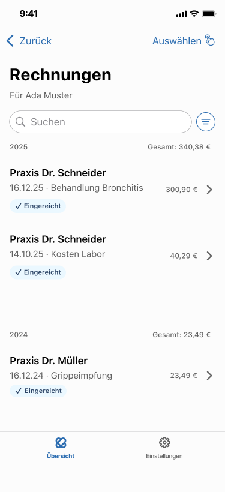

= Use Case - Rechnungen anzeigen

link:overview.adoc[Zurück zur Übersicht]

[cols="h,1"]
|===
| ID | UC_RECHNUNGEN_ANZEIGEN
| Verbindlichkeit | MUSS
| Letzte Aktualisierung | 2026-05-22
| Kurzbeschreibung | Der Use Case beschreibt, wie Versicherte ihre Rechnungen in der App als Liste einsehen, durchsuchen und in die Detailansicht wechseln.
| Akteure | Versicherter
| Vorbedingungen
 a| * Der Versicherte ist in der App angemeldet (online oder offline mit lokal verfugbaren Daten). +
* Es liegen Rechnungsdaten vor (vom Fachdienst geladen oder lokal gespeichert).
| Auslöser/Trigger | Der Versicherte offnet die App.
| Hauptablauf
 a| * Die App zeigt die Liste der Rechnungen an. +
* Pro Rechnung werden mindestens angezeigt: ausstellende LEI, Status (z. B. bezahlt/eingereicht), Rechnungsdatum. +
* Der Versicherte kann suchen, sortieren und filtern.
| Alternativ-/Fehlerablaufe
 a| * Keine Internet-Verbindung: Die App zeigt lokal vorhandene Rechnungen und einen Offline-Hinweis. +
* Ladefehler: App zeigt einen verständlichen Fehlerzustand mit erneuter Ladeoption.
| Nachbedingungen/Ergebnis
 a| * Die Rechnungsubersicht ist fur den Versicherten sichtbar. +
* Bei Auswahl einer Rechnung wird die zugehörige Detailansicht geöffnet link:detail-ansicht.adoc[UC_DETAIL_ANSICHT].
|===

== Mockup

